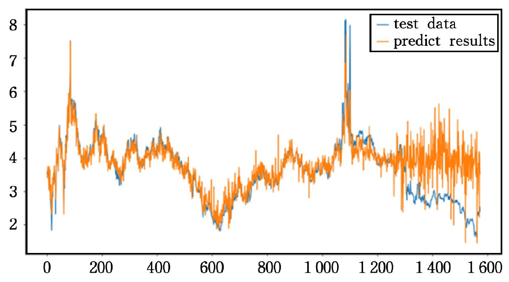








I am a doctoral student studying at the Center of Digital Dentistry, [Peking University School and Hospital of Stomatology](https://ss.bjmu.edu.cn/). I am working with teachers Sun Yuchun and Tian Sukun. Before that, I received my master's degree from the University of Chinese Academy of Sciences. Graduated from the Computer Science Department of Jilin University with a bachelor's degree.  
  
My research interests include *3D completion and reconstruction* and *metamaterial design*. Specifically, I focus on using 3D computer technology to solve design and segmentation tasks in dentistry. In addition, I am also working on metamaterial structure design and gingival margin line fenge tasks.

# 🔥 News
+   \[05/2024\] Our paper on video shadow detection is accepted at [CVPR'2023](https://cvpr2023.thecvf.com/)!
+   news1
+   news2
+   news3

# 📝 Publications 

CVPR 2016

[News-based Research on Forecast of International Natural gas price trend](https://books.google.com/books?hl=zh-CN&lr=&id=ey4NEAAAQBAJ&oi=fnd&pg=PA194&dq=News-based+Research+on+Forecast+of+International+Natural+gas+price+trend&ots=2maa8AyIH5&sig=_iY4BmQzlqeo-dc7hvejDs3IPGM#v=onepage&q=News-based%20Research%20on%20Forecast%20of%20International%20Natural%20gas%20price%20trend&f=false)

**Li Tianxiang**, Han Xiaosong, Wang Aoqing, Li Hui, Liu Guosheng, Pei Ying

[**Github Link**](https://github.com/Hugo271828/gasNewsPickle) <strong></strong>
- Lorem ipsum dolor sit amet, consectetur adipiscing elit. Vivamus ornare aliquet ipsum, ac tempus justo dapibus sit amet. 

- [Lorem ipsum dolor sit amet, consectetur adipiscing elit. Vivamus ornare aliquet ipsum, ac tempus justo dapibus sit amet](https://github.com), A, B, C, **CVPR 2020**

# 🎖 Honors and Awards
- \[2017, 2018\] Individual Scholarship, Jilin University
- \[2018\] **Second prize**, National English Competition for College Students
- \[2018\] **First prize**, Mathematical Modeling Competition in Jilin province
- \[2018\] **Third prize**, Asia-Pacific Mathematical Modeling Competition	
- \[2022\] **Merit student** of University of Chinese Academy of Sciences University	
# 📖 Educations
- \[2016-2020\], Jilin University, Bachelor of Computer Science and Technology
- \[2017-2019\], Jilin University, Bachelor of Accounting（Double degree）
- \[2020-2023\], UCAS, Master of Computer Application Technology
- \[2023-\], Peking University School and Hospital of Stomatology
